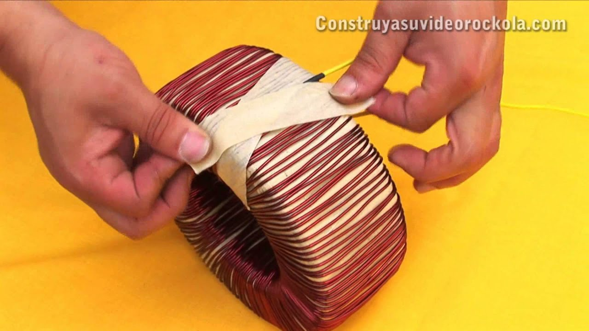

# Cómo-calcular-y-hacer-un-transformador-toroidal-casero

> 🆓 **نسخه رایگان** - کیفیت 360p
> برای کیفیت بالاتر، MP3، زیرنویس و رمزگذاری به [workflow شماره 01](../../actions) بروید

  <picture>
    
  </picture>

---

## Video Information

| Property | Value |
|----------|-------|
| **Video Name** | `Cómo-calcular-y-hacer-un-transformador-toroidal-casero` |
| **Original Link** | [YouTube Video](https://www.youtube.com/watch?v=Q6GkSNfAEx4) |
| **Total Size** | **3 parts** - **120.82 MB** |
| **Quality** | **360p (Free)** |

---

## Download Links

> ⬇️ Download **all parts**, then open `Cómo-calcular-y-hacer-un-transformador-toroidal-casero.zip`

| # | File | Link |
|---|------|------|
| 1 | `Cómo-calcular-y-hacer-un-transformador-toroidal-casero.z01` | [Download](https://raw.githubusercontent.com/samenblog/Ourtube/main/videos/C%C3%B3mo-calcular-y-hacer-un-transformador-toroidal-casero/C%C3%B3mo-calcular-y-hacer-un-transformador-toroidal-casero.z01) |
| 2 | `Cómo-calcular-y-hacer-un-transformador-toroidal-casero.z02` | [Download](https://raw.githubusercontent.com/samenblog/Ourtube/main/videos/C%C3%B3mo-calcular-y-hacer-un-transformador-toroidal-casero/C%C3%B3mo-calcular-y-hacer-un-transformador-toroidal-casero.z02) |
| 3 | `Cómo-calcular-y-hacer-un-transformador-toroidal-casero.zip` | [Download](https://raw.githubusercontent.com/samenblog/Ourtube/main/videos/C%C3%B3mo-calcular-y-hacer-un-transformador-toroidal-casero/C%C3%B3mo-calcular-y-hacer-un-transformador-toroidal-casero.zip) |

---

*🆓 Free Version - [avasam.ir](https://avasam.ir)*
