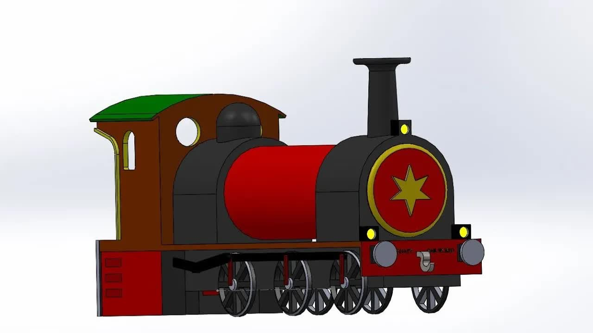

# How-to-make-a-Steam-locomotive：-Solidworks-tutorial

> 🆓 **نسخه رایگان** - کیفیت 360p
> برای کیفیت بالاتر، MP3، زیرنویس و رمزگذاری به [workflow شماره 01](../../actions) بروید

  <picture>
    
  </picture>

---

## Video Information

| Property | Value |
|----------|-------|
| **Video Name** | `How-to-make-a-Steam-locomotive：-Solidworks-tutorial` |
| **Original Link** | [YouTube Video](https://www.youtube.com/watch?v=06TNDL1nNTk) |
| **Total Size** | **2 parts** - **45.06 MB** |
| **Quality** | **360p (Free)** |

---

## Download Links

> ⬇️ Download **all parts**, then open `How-to-make-a-Steam-locomotive：-Solidworks-tutorial.zip`

| # | File | Link |
|---|------|------|
| 1 | `How-to-make-a-Steam-locomotive：-Solidworks-tutorial.z01` | [Download](https://raw.githubusercontent.com/samenblog/Ourtube/main/videos/How-to-make-a-Steam-locomotive%EF%BC%9A-Solidworks-tutorial/How-to-make-a-Steam-locomotive%EF%BC%9A-Solidworks-tutorial.z01) |
| 2 | `How-to-make-a-Steam-locomotive：-Solidworks-tutorial.zip` | [Download](https://raw.githubusercontent.com/samenblog/Ourtube/main/videos/How-to-make-a-Steam-locomotive%EF%BC%9A-Solidworks-tutorial/How-to-make-a-Steam-locomotive%EF%BC%9A-Solidworks-tutorial.zip) |

---

*🆓 Free Version - [avasam.ir](https://avasam.ir)*
