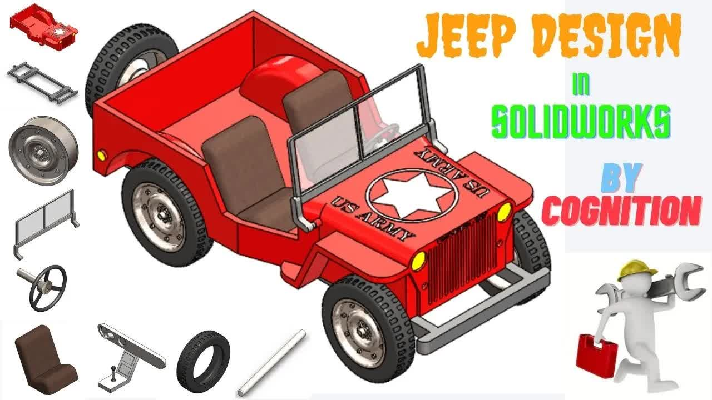

# Jeep-Design-tutorial-in-SOLIDWORKS-｜｜-3D-Modeling-and-Sketch-｜｜-SOLIDWORKS-CAD-Practice-｜｜-COGNITION

> 🆓 **نسخه رایگان** - کیفیت 360p
> برای کیفیت بالاتر، MP3، زیرنویس و رمزگذاری به [workflow شماره 01](../../actions) بروید

  <picture>
    
  </picture>

---

## Video Information

| Property | Value |
|----------|-------|
| **Video Name** | `Jeep-Design-tutorial-in-SOLIDWORKS-｜｜-3D-Modeling-and-Sketch-｜｜-SOLIDWORKS-CAD-Practice-｜｜-COGNITION` |
| **Original Link** | [YouTube Video](https://www.youtube.com/watch?v=RACA3CUfBbE) |
| **Total Size** | **6 parts** - **231.71 MB** |
| **Quality** | **360p (Free)** |

---

## Download Links

> ⬇️ Download **all parts**, then open `Jeep-Design-tutorial-in-SOLIDWORKS-｜｜-3D-Modeling-and-Sketch-｜｜-SOLIDWORKS-CAD-Practice-｜｜-COGNITION.zip`

| # | File | Link |
|---|------|------|
| 1 | `Jeep-Design-tutorial-in-SOLIDWORKS-｜｜-3D-Modeling-and-Sketch-｜｜-SOLIDWORKS-CAD-Practice-｜｜-COGNITION.z01` | [Download](https://raw.githubusercontent.com/samenblog/Ourtube/main/videos/Jeep-Design-tutorial-in-SOLIDWORKS-%EF%BD%9C%EF%BD%9C-3D-Modeling-and-Sketch-%EF%BD%9C%EF%BD%9C-SOLIDWORKS-CAD-Practice-%EF%BD%9C%EF%BD%9C-COGNITION/Jeep-Design-tutorial-in-SOLIDWORKS-%EF%BD%9C%EF%BD%9C-3D-Modeling-and-Sketch-%EF%BD%9C%EF%BD%9C-SOLIDWORKS-CAD-Practice-%EF%BD%9C%EF%BD%9C-COGNITION.z01) |
| 2 | `Jeep-Design-tutorial-in-SOLIDWORKS-｜｜-3D-Modeling-and-Sketch-｜｜-SOLIDWORKS-CAD-Practice-｜｜-COGNITION.z02` | [Download](https://raw.githubusercontent.com/samenblog/Ourtube/main/videos/Jeep-Design-tutorial-in-SOLIDWORKS-%EF%BD%9C%EF%BD%9C-3D-Modeling-and-Sketch-%EF%BD%9C%EF%BD%9C-SOLIDWORKS-CAD-Practice-%EF%BD%9C%EF%BD%9C-COGNITION/Jeep-Design-tutorial-in-SOLIDWORKS-%EF%BD%9C%EF%BD%9C-3D-Modeling-and-Sketch-%EF%BD%9C%EF%BD%9C-SOLIDWORKS-CAD-Practice-%EF%BD%9C%EF%BD%9C-COGNITION.z02) |
| 3 | `Jeep-Design-tutorial-in-SOLIDWORKS-｜｜-3D-Modeling-and-Sketch-｜｜-SOLIDWORKS-CAD-Practice-｜｜-COGNITION.z03` | [Download](https://raw.githubusercontent.com/samenblog/Ourtube/main/videos/Jeep-Design-tutorial-in-SOLIDWORKS-%EF%BD%9C%EF%BD%9C-3D-Modeling-and-Sketch-%EF%BD%9C%EF%BD%9C-SOLIDWORKS-CAD-Practice-%EF%BD%9C%EF%BD%9C-COGNITION/Jeep-Design-tutorial-in-SOLIDWORKS-%EF%BD%9C%EF%BD%9C-3D-Modeling-and-Sketch-%EF%BD%9C%EF%BD%9C-SOLIDWORKS-CAD-Practice-%EF%BD%9C%EF%BD%9C-COGNITION.z03) |
| 4 | `Jeep-Design-tutorial-in-SOLIDWORKS-｜｜-3D-Modeling-and-Sketch-｜｜-SOLIDWORKS-CAD-Practice-｜｜-COGNITION.z04` | [Download](https://raw.githubusercontent.com/samenblog/Ourtube/main/videos/Jeep-Design-tutorial-in-SOLIDWORKS-%EF%BD%9C%EF%BD%9C-3D-Modeling-and-Sketch-%EF%BD%9C%EF%BD%9C-SOLIDWORKS-CAD-Practice-%EF%BD%9C%EF%BD%9C-COGNITION/Jeep-Design-tutorial-in-SOLIDWORKS-%EF%BD%9C%EF%BD%9C-3D-Modeling-and-Sketch-%EF%BD%9C%EF%BD%9C-SOLIDWORKS-CAD-Practice-%EF%BD%9C%EF%BD%9C-COGNITION.z04) |
| 5 | `Jeep-Design-tutorial-in-SOLIDWORKS-｜｜-3D-Modeling-and-Sketch-｜｜-SOLIDWORKS-CAD-Practice-｜｜-COGNITION.z05` | [Download](https://raw.githubusercontent.com/samenblog/Ourtube/main/videos/Jeep-Design-tutorial-in-SOLIDWORKS-%EF%BD%9C%EF%BD%9C-3D-Modeling-and-Sketch-%EF%BD%9C%EF%BD%9C-SOLIDWORKS-CAD-Practice-%EF%BD%9C%EF%BD%9C-COGNITION/Jeep-Design-tutorial-in-SOLIDWORKS-%EF%BD%9C%EF%BD%9C-3D-Modeling-and-Sketch-%EF%BD%9C%EF%BD%9C-SOLIDWORKS-CAD-Practice-%EF%BD%9C%EF%BD%9C-COGNITION.z05) |
| 6 | `Jeep-Design-tutorial-in-SOLIDWORKS-｜｜-3D-Modeling-and-Sketch-｜｜-SOLIDWORKS-CAD-Practice-｜｜-COGNITION.zip` | [Download](https://raw.githubusercontent.com/samenblog/Ourtube/main/videos/Jeep-Design-tutorial-in-SOLIDWORKS-%EF%BD%9C%EF%BD%9C-3D-Modeling-and-Sketch-%EF%BD%9C%EF%BD%9C-SOLIDWORKS-CAD-Practice-%EF%BD%9C%EF%BD%9C-COGNITION/Jeep-Design-tutorial-in-SOLIDWORKS-%EF%BD%9C%EF%BD%9C-3D-Modeling-and-Sketch-%EF%BD%9C%EF%BD%9C-SOLIDWORKS-CAD-Practice-%EF%BD%9C%EF%BD%9C-COGNITION.zip) |

---

*🆓 Free Version - [avasam.ir](https://avasam.ir)*
